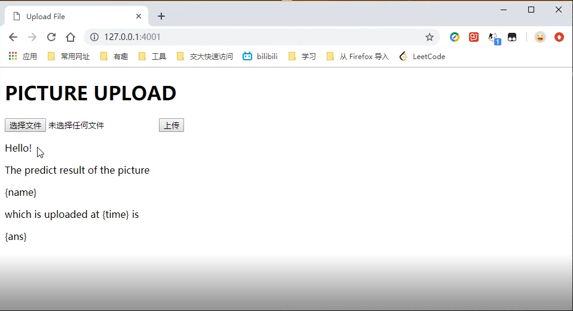
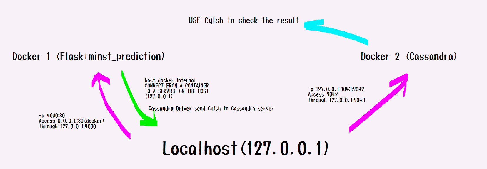

# Big data Project BD-28
# Handwritten numbers classification with Minst and Docker
### He Yunfan 何云帆

## Objectives
#### Local:  
1. find a minst prediction code
2. save the model at the local place
#### Docker:
1. load the model file
2. for any given picture f(x)=digit
3. implement f(x) in flask and container
4. write the current time, file name, and predict result in cassandra.

## Background knowledge
### Flask
[Flask's docmentation](https://flask.palletsprojects.com/en/1.1.x/)  
##### flask_hellowd.py
```
from flask import Flask
app = Flask(__name__)

@app.route('/')
def hello_world():
    return 'Hello World!'

if __name__ == '__main__':
    app.run()
```
### Docker
[Docker APP Intro](https://docs.docker.com/get-started/)

### Cassandra
[Cassandra tutorial in Chinese](https://www.w3cschool.cn/cassandra/)  
[Cassandra Driver -- Use python to control cassandra server](https://docs.datastax.com/en/developer/python-driver/3.19/)

## Procedure
### Generate a prediction model
Since I am not familiar with Tensorflow code. Instead, I use keras to predict the minst dataset.   
The first python code generates the model of prediction. The accuracy of this model is 98% using CNN.   
I prepare 0-9 picture written by myself.  
The second python code will first transform any arbitrary image input into size=(28,28) then the model will predict the result.

##### minst_model.py
```
from keras.datasets import mnist
from keras.utils import to_categorical

train_X, train_y = mnist.load_data()[0]
train_X = train_X.reshape(-1, 28, 28, 1)
train_X = train_X.astype('float32')
train_X /= 255
train_y = to_categorical(train_y, 10)

from keras.models import Sequential
from keras.layers import Conv2D, MaxPool2D, Flatten, Dropout, Dense
from keras.losses import categorical_crossentropy
from keras.optimizers import Adadelta

model = Sequential()
model.add(Conv2D(32, (5,5), activation='relu', input_shape=[28, 28, 1]))
model.add(Conv2D(64, (5,5), activation='relu'))
model.add(MaxPool2D(pool_size=(2,2)))
model.add(Flatten())
model.add(Dropout(0.5))
model.add(Dense(128, activation='relu'))
model.add(Dropout(0.5))
model.add(Dense(10, activation='softmax'))

model.compile(loss=categorical_crossentropy,
             optimizer=Adadelta(),
             metrics=['accuracy'])

batch_size = 100
epochs = 8
model.fit(train_X, train_y,
         batch_size=batch_size,
         epochs=epochs)

test_X, test_y = mnist.load_data()[1]
test_X = test_X.reshape(-1, 28, 28, 1)
test_X = test_X.astype('float32')
print(test_X[1])
test_X /= 255
test_y = to_categorical(test_y, 10)
loss, accuracy = model.evaluate(test_X, test_y, verbose=1)
print('loss:%.4f accuracy:%.4f' %(loss, accuracy))

model.save('mnistmodel.h5')
```
##### predict.py
```
import os
import numpy as np
import matplotlib.pyplot as plt
from keras.datasets import mnist
from keras.models import load_model
from PIL import Image

size=(28,28)
dir_img="./"
img_name="0.png"
tlabel=0
ori_image = Image.open(dir_img+img_name)
ori_image=ori_image.convert('1')
pre_image = ori_image.resize(size, Image.ANTIALIAS)

plt.imshow(pre_image, cmap='gray_r')
plt.title("original {}".format(tlabel))
plt.show()

pre_image=np.array(pre_image).reshape((1,28,28,1))

myModel = load_model('mnistmodel.h5')

predict = myModel.predict(pre_image)
print(predict)
predict = np.argmax(predict)
print('original:', tlabel)
print('predicted:', predict)
```

### Implement basic function (upload files and predict) in the local host
Reference: [Flask 实现单个文件上传](https://www.jianshu.com/p/c37c4613b07d)

```
import tensorflow as tf
import os
import time
from flask import Flask, request, url_for, send_from_directory
import socket
import numpy as np
import keras
from keras.models import load_model
from PIL import Image

if not os.path.exists("uploads"):
    os.mkdir("uploads") 

app = Flask(__name__)
app.config['UPLOAD_FOLDER'] = os.getcwd()+"/uploads"

html = '''
    <!DOCTYPE html>
    <title>Upload File</title>
    <h1>PICTURE UPLOAD</h1>
    <form method=post enctype=multipart/form-data>
         <input type=file name=file>
         <input type=submit value=上传>
    </form>
    <p>Hello!</p>
    <p>The predict result of the picture</p>
    <p>{name}</p>
    <p>which is uploaded at {time} is</p>
    <p>{ans}</p>
    '''
@app.route('/', methods=['GET', 'POST'])
def upload_file():
    if request.method == 'POST':
        file = request.files['file']
        if file:
            timestamp=time.strftime("%Y-%m-%d-%H_%M_%S",time.localtime(time.time()))
            filename=timestamp +".png"
            file.save(os.path.join(app.config['UPLOAD_FOLDER'], filename))
            size=(28,28)
            dir_img="uploads/"
            img_name=filename
            
            ori_image = Image.open(dir_img+img_name)
            ori_image= ori_image.convert('L')
            pre_image = ori_image.resize(size, Image.ANTIALIAS)

            pre_image=np.array(pre_image).reshape((1,28,28,1))

            keras.backend.clear_session() 
            myModel = load_model('mnistmodel.h5')

            predict = myModel.predict(pre_image)
            predict = np.argmax(predict)
            
            return html.format(name=img_name,time=timestamp,ans=predict)
    return html

if __name__ == "__main__":
    app.run(host='0.0.0.0', port=80)
```


### Implement Flask in Docker and Connect the host with the container
1. Build app in docker ([tutorial](https://docs.docker.com/get-started/))
* Dockerfile  
NOTES: Python 3.6, change to tsinghua source (faster)
```
# Use an official Python runtime as a parent image
FROM python:3.6

# Set the working directory to /app
WORKDIR /app

# Copy the current directory contents into the container at /app
COPY . /app

# Install any needed packages specified in requirements.txt
RUN pip3 install -r requirements.txt -i https://pypi.tuna.tsinghua.edu.cn/simple

# Make port 80 available to the world outside this container
EXPOSE 80

# Define environment variable
ENV NAME World

# Run app.py when the container launches
CMD ["python", "app.py"]
```
* requirements.txt
```
Flask
pillow
tensorflow
keras==2.2.4
cassandra-driver
```
Use `docker build --tag=heyf4_minst .` to build the image.  
2. Visit the docker through the host  
Use `docker run -p 4000:80 heyf4_minst` to run the app.py (4000 can be replaced by any not busy port number)  
  
the uploaded picture will be renamed and save in the folder /uploads

### Build Cassandra Docker
It is easy to install cassandra in docker.  
Here is the precedure.  
[tutorial](https://hub.docker.com/_/cassandra/)  
```
docker pull cassandra
docker run --name heyf4-cassandra --network some-network -d cassandra:latest
docker run -it --network some-network --rm cassandra cqlsh heyf4-cassandra
```
If there is no network named some-network in your computer, you can create it.  
[detailed tutorial](https://docs.docker.com/engine/reference/commandline/network_create/)
```
docker network create some-network
```
Actually, in my testing, I can build my cassandra docker and use it, but I cannot connect cassandra server using cassandra driver (use python code to control cassandra).  
Solution: map localhost:9043 (127.0.0.1:9043) to 9042 port in the docker 
```
docker run --name heyf4-test-cassandra --network some-network  -p 127.0.0.1:9043:9042 -d cassandra:latest
```



### Use python code in local to test the function of CQLSH
I write the following code to test whether the host can interact with cassandra docker well.
```
import logging


log = logging.getLogger()

log.setLevel('INFO')

handler = logging.StreamHandler()

handler.setFormatter(logging.Formatter("%(asctime)s [%(levelname)s] %(name)s: %(message)s"))

log.addHandler(handler)

#from cassandra.cluster import Cluster

#from cassandra import ConsistencyLevel

from cassandra.cluster import Cluster

from cassandra.query import SimpleStatement


KEYSPACE = "myminstkeyspace"


def createKeySpace():

    cluster = Cluster(contact_points=['127.0.0.1'],port=9043)

    session = cluster.connect()


    log.info("Creating keyspace...")

    try: 
        session.execute("DROP KEYSPACE %s"%KEYSPACE)

        session.execute("""
            CREATE KEYSPACE %s
            WITH replication = { 'class': 'SimpleStrategy', 'replication_factor': '2' }
            """ % KEYSPACE)


        log.info("setting keyspace...")

        session.set_keyspace(KEYSPACE)


        log.info("creating table...")

        session.execute(
            """
            CREATE TABLE minst_table(
                insert_time text,
                insert_name text,
                predict_result int,
                PRIMARY KEY (insert_time)
            )
            """)

        session.execute(
            """
            INSERT INTO minst_table (insert_time, insert_name, predict_result)
            VALUES (%(insert_time)s, %(insert_name)s, %(predict_result)s)
            """,
            {'insert_time': "2019-09-17-20_00_59", 'insert_name': "2019-09-17-20_00_59.png", 'predict_result': 8}
            )
        # k=session.execute("SELECT * from minst_table")
        # print(k[0])

    except Exception as e:

        log.error("Unable to create keyspace")

        log.error(e)


createKeySpace()
# from cassandra.cluster import Cluster

# KEYSPACE = "minstkeyspace"

# cluster = Cluster(
#     ['127.0.0.1'],
#     port=9043)

# session = cluster.connect()
# session.set_keyspace(KEYSPACE)
# session.execute("select * from minst_table_1;")
```

### Connect Flask Docker with the host and connect Cassandra with the host (make the commnication with )
The first time I use the following code, `error: unable to connect to server`.  
```
cluster = Cluster(contact_points=['127.0.0.1'],port=9043)
session = cluster.connect()
```
I google this problem, here is the solution.   
[I WANT TO CONNECT FROM A CONTAINER TO A SERVICE ON THE HOST](https://docs.docker.com/docker-for-windows/networking/)
```
cluster = Cluster(contact_points=['host.docker.internal'],port=9043)
session = cluster.connect()
```


#### full version app.py
```
import tensorflow as tf
import os
import time
from flask import Flask, request, url_for, send_from_directory
import socket
import numpy as np
import keras
from keras.models import load_model
from PIL import Image
from cassandra.cluster import Cluster
from cassandra.query import SimpleStatement

KEYSPACE = "myminstkeyspace"
# cluster = Cluster(contact_points=['127.0.0.1'],port=9043)
# session = cluster.connect()
cluster = Cluster(contact_points=['host.docker.internal'],port=9043)
session = cluster.connect()

session.execute("DROP KEYSPACE %s"%KEYSPACE)

session.execute("""
    CREATE KEYSPACE %s
    WITH replication = { 'class': 'SimpleStrategy', 'replication_factor': '2' }
    """ % KEYSPACE)

session.set_keyspace(KEYSPACE)

session.execute(
    """
    CREATE TABLE minst_table(
        insert_time text,
        insert_name text,
        predict_result int,
        PRIMARY KEY (insert_time)
    )
    """)

if not os.path.exists("uploads"):
    os.mkdir("uploads") 

app = Flask(__name__)
app.config['UPLOAD_FOLDER'] = os.getcwd()+"/uploads"

html = '''
    <!DOCTYPE html>
    <title>Upload File</title>
    <h1>PICTURE UPLOAD</h1>
    <form method=post enctype=multipart/form-data>
         <input type=file name=file>
         <input type=submit value=上传>
    </form>
    <p>Hello!</p>
    <p>The predict result of the picture</p>
    <p>{name}</p>
    <p>which is uploaded at {time} is</p>
    <p>{ans}</p>
    '''
@app.route('/', methods=['GET', 'POST'])
def upload_file():
    if request.method == 'POST':
        file = request.files['file']
        if file:
            timestamp=time.strftime("%Y-%m-%d-%H_%M_%S",time.localtime(time.time()))
            filename=timestamp +".png"
            file.save(os.path.join(app.config['UPLOAD_FOLDER'], filename))
            size=(28,28)
            dir_img="uploads/"
            img_name=filename
            
            ori_image = Image.open(dir_img+img_name)
            ori_image= ori_image.convert('L')
            pre_image = ori_image.resize(size, Image.ANTIALIAS)

            pre_image=np.array(pre_image).reshape((1,28,28,1))

            keras.backend.clear_session() 
            myModel = load_model('mnistmodel.h5')

            predict = myModel.predict(pre_image)
            predict = np.argmax(predict)
            
            session.execute(
                """
                INSERT INTO minst_table (insert_time, insert_name, predict_result)
                VALUES (%(insert_time)s, %(insert_name)s, %(predict_result)s)
                """,
                {'insert_time': timestamp, 'insert_name': img_name, 'predict_result': predict}
            )

            return html.format(name=img_name,time=timestamp,ans=predict)
    return html

if __name__ == "__main__":
    app.run(host='0.0.0.0', port=80)
```

## Result
I post the result video on google drive.  
[Click to see the video](https://drive.google.com/file/d/1xHX2RNz9pSYJgOauUaju7xhSFXe-WPLN/view?usp=sharing)


Through this project, I learn many knowledge of Big Data. And I also learn how to use the basic tools of Big data. 

Many thanks to Professor Fan. I am grateful for Professor Fan's lecture and help.
